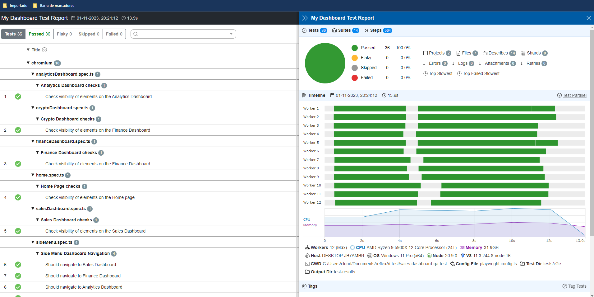

 
---

# Automation tests for the [Sales Dashboard](https://www.figma.com/file/kspPAPHBqPQmBsmbalEIRn/Vristo-Sales-Dashboard?type=design&node-id=0-1&mode=design) project prompt.

## Tech Stack used :computer:
**Automation Framework**: Playwright (version 1.39)

**Language used**: Pure Typescript

**Pattern used**: Basic Page Object Model, nothing related to BDD/Gherkin whatsoever as it wasn’t needed.

## Installation :wrench:
1. Clone this repo to your local machine
2. Open the cloned repo with your favorite IDE (I'd encourage you to use VSCode above all else, but that's up to you :smirk:)
3. Open your terminal and type: **`npm i`** (Wait for a while since it can take some time due to Playwright installing emulated browsers as part of the process)

_**OPTIONAL**_ 
I have included some really simple performance test for different types of situations *(Scenario-based, Spikes, Constant Throughput)*, but to execute those you'll need to *install k6* first, for that you should look into the [following page](https://k6.io/docs/get-started/installation/).

---
## Usage :hammer_and_wrench:
- In order to run some tests, you should first pay attention to the commands to call the tests, those commands are defined at the _**package.json**_ file at the *"scripts"* section, for starters the most basic command in order to run all the test from the _**tests/e2e**_ folder would be **`npm run test:e2e`** this will run all of the tests for Web/UI Automation of the Sales Dashboard.
- Aside from the command mentioned above I added other silly unit tests with **jest** just for the sake of it haha, and in order to run those, you should execute **`npm run test:unit`**
- Additionally there's a command that will run them both sequentally which is **`npm test`** *(this will execute the e2e suite first and then the unit tests)*.

_**OPTIONAL FOR PERFORMANCE TESTING**_ 
Just as it was mentioned in the installation section, if you did installed K6, you will then be able to run any of the 3 performance tests by simply executing:
**`k6 run tests\performance-tests\name_of_the_script.ts`**

## Additional Arguments for the Run Commands :nut_and_bolt:
- **`npm run tests:e2e --debug`** -> This command will run the tests along with the Playwright Inspector/Debugger, which will allow you to see the execution and advance through it's steps in order to debug something or plainly to check if everything is ok for the test itself (*This is an amazing debugger so use it!*)
- **`npm run tests:e2e --ui`** -> This command will launch the "quite new" UI mode from Playwright which resembles the famous Cypress Time Machine.
- **`npm run tests:e2e --workers=N`** -> By default Playwright uses as many workers as Suites of tests you have defined (*which is awesome*) nevertheless and given some limitations to certain environment and how slow they might be if they are bombed with various users trying to use the same function the wait times might be exceeded and therefore the test will be shown as a failure (*resulting in flaky tests*) for those cases playwright allows you to limit those virtual users/workers by using this command.

Now this is only a few of the commands you can use through the command-line, for more information about other commands go here :rocket: -> https://playwright.dev/docs/test-cli 

---
## Diving into the Framework :swimming_man:

### Page Object Model :page_with_curl:
The framework is built considering/using Page Object Model, therefore you'll see that you have various PageObjects *.ts* files that contain all the locators for the different pages that the portal has, these are elements that will be growing on time and it's recommended that if you find some locator actually missing from them to add them inmediatly :smile:

I won't cover too much of Page Object here since it's not the purpose of this Readme and this is just a basic test which somehow doesn't wants to tackle that topic specifically, but if you need to actually get on the ropes in order to use this, I strongly recommend you to visit the official Playwright documentation about this, since it does a pretty good job at explaining it -> https://playwright.dev/docs/test-pom

### Annotations for the tests in Playwright :writing_hand:
There are a bunch of parameters that you can use for tests in Playwright a couple of them that I'd say are the most useful ones are the following:

- *`test.only`* -> this one will allow you to *run only that test or suite and will leave all the other test cases excluded* for the upcoming run
- *`test.skip`* -> this one will allow you to *skip an specific test or even a whole suite* for the upcoming run
- *`test.describe`* -> this annotation allows you to group tests in "Test Suites", you'll see this in each *test.spec.ts* that we have on the framework
- **Tags** -> there'll be times when you'll want to tag a couple of tests in order to run just the tests with an specific tag (e.g: *@slow or @fast*), I have not used any of those for the sake of this Test, but it's always good to mention them haha.

You can find examples of usage for each case here -> https://playwright.dev/docs/test-annotations

### Reports :bar_chart:
By default Playwright offers a pretty good out-of-box solution for reporting, but I must say that I'm more of a fan of Allure and/or Monocart Reporter, so for this particular test I used the latter.
This means that every time that you run your E2E/UI Tests *(Limited to those)* you'll get 2 reports, which are:

1. Standard HTML Report, which will be located at the **playwright-report** folder and you can open it by either opening the index.html with your browser or by executing **`npx playwright show-report`** after the execution is done.
2. Monocart Reporter, which will be located at the **test-results** folder and you can open it by either opening the report.html with your browser or by executing **`npx monocart show-report test-results/report.html`**

After executing all of this, you'll come up with a report that will look like this:

---
## Caveats / Considerations :thinking:
- No environment variables were used for this PoC/Test as it wasn't really needed due to the depth of the app.
- No Gherkin/Cucumber was used either as it would've required more than the alotted time for this (2-3 hours) and it didn't feel like it would yield better results due to the depth of the tests that could be conducted here.
- The E2E suite will run only on Chromium and Firefox as it somehow made more sense for the time being.
- This framework only considers:
    - Basic Unit tests.
    - Web/UI Automation tests of the basic aspects of the app according to the broad criteria.
    - Some really basic performance tests just for the sake of existing haha.
    - Nothing automated on the Mobile end as there was no way to test this on Mobile currently.

---
## Additional Information and References :open_book:

**Playwright Docs**: https://playwright.dev/docs/intro

**Jest Docs**: https://jestjs.io/docs/getting-started

**Monocart Reporter**: https://github.com/cenfun/monocart-reporter